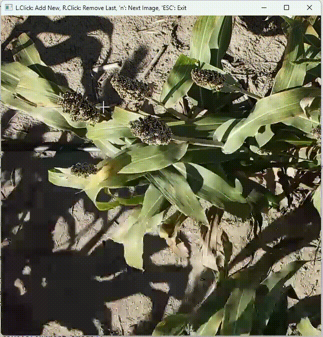
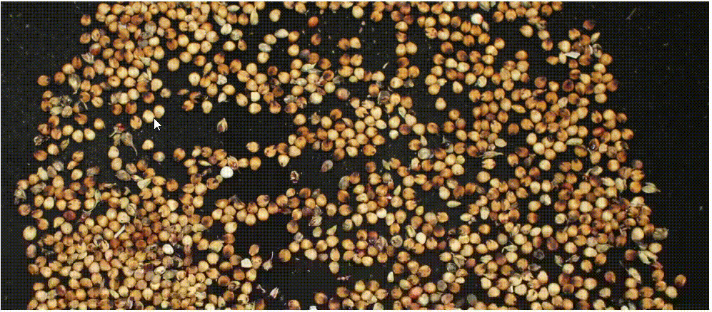

# Deep Learning for Sorghum Yield Forecasting using Uncrewed Aerial Systems and Lab-Derived Imagery

<p align="center">
  
</p>
<p align="center">
  
</p>

This is the codebase for the paper "Deep Learning for Sorghum Yield Forecasting using Uncrewed Aerial Systems and Lab-Derived Imagery". All the experiments are provided in the `codes` folder as jupyter notebooks. We provided sample data for running all the codes in the `sample data` folder. The weights of our trained models are in the `weights` folder.

## Setup

This repository contains large files, for which Git LFS needs to be installed from [here](https://docs.anaconda.com/miniconda/miniconda-install/). The large files must be initialized by `git lfs install` in your repo and pulled using `git lfs pull` after cloning this repo. Though optional, we highly recommend to download and install Miniconda from [here](https://docs.anaconda.com/miniconda/miniconda-install/) and create a conda environment for running this codebase. Moreover, you must install PyTorch from the official website in your desired environment by following the instructions given [here](https://pytorch.org/) for your OS and CUDA version. Once PyTorch is installed, run the following command after cloning the repo to install necessary packages:

```
pip install -r requirements.txt
```
If you use our code or find it to be helpful in your research, please use the following BibTeX entry for citation.

```
@article{bari2025plantphenomics,
title = {Deep Learning for Sorghum Yield Forecasting using Uncrewed Aerial Systems and Lab-Derived Imagery},
journal = {Plant Phenomics},
pages = {100133},
year = {2025},
issn = {2643-6515},
doi = {https://doi.org/10.1016/j.plaphe.2025.100133},
url = {https://www.sciencedirect.com/science/article/pii/S2643651525001396},
author = {Md.Abdullah {Al Bari} and Aliva Bakshi and Jahid Chowdhury Choton and Swaraj Pramanik and Trevor D. Witt and Doina Caragea and Scott Bean and S.V. {Krishna Jagadish} and Terry Felderhoff}
}
```
